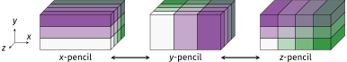
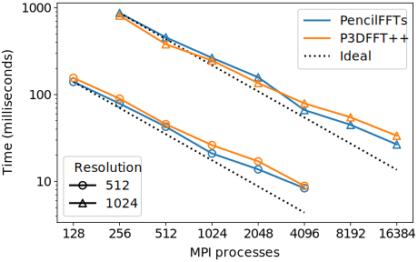

# PencilFFTs.jl

Fast Fourier transforms of MPI-distributed Julia arrays.

This package provides functionality to distribute multidimensional arrays among
MPI processes, and to perform multidimensional FFTs (and related transforms) on
them.

The name of this package originates from the decomposition of 3D domains along
two out of three dimensions, sometimes called *pencil* decomposition.
This is illustrated by the figure below
([adapted from here](https://hal.archives-ouvertes.fr/tel-02084215v1)),
where each coloured block is managed by a different MPI process.
Typically, one wants to compute FFTs on a scalar or vector field along the
three spatial dimensions.
In the case of a pencil decomposition, 3D FFTs are performed one dimension at
a time (along the non-decomposed direction, using a serial FFT implementation).
Global data transpositions are then needed to switch from one pencil
configuration to the other and perform FFTs along the other dimensions.

   
  

## Performance

The performance of PencilFFTs is on par with widely adopted MPI-based FFT
libraries implemented in lower-level languages.
This is seen in the below comparison with the [P3DFFT++](https://www.p3dfft.net/) library
(see [the benchmarks section](https://jipolanco.github.io/PencilFFTs.jl/dev/benchmarks/) in the docs for details).

   
  

