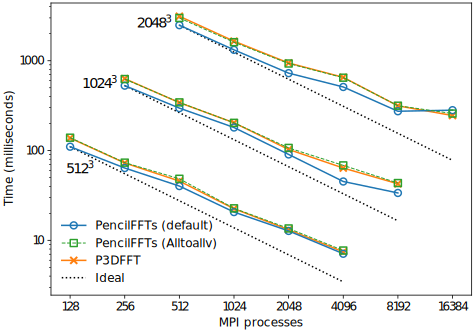

# PencilFFTs.jl

[](https://jipolanco.github.io/PencilFFTs.jl/stable/)
[](https://jipolanco.github.io/PencilFFTs.jl/dev/)
[](https://travis-ci.com/jipolanco/PencilFFTs.jl)

Fast Fourier transforms of MPI-distributed Julia arrays.

This package provides functionality to distribute multidimensional arrays among
MPI processes, and to perform multidimensional FFTs (and related transforms) on
them.

The name of this package originates from the decomposition of 3D domains along
two out of three dimensions, sometimes called *pencil* decomposition.
This is illustrated by the figure below
([adapted from here](https://hal.archives-ouvertes.fr/tel-02084215v1)),
where each coloured block is managed by a different MPI process.
Typically, one wants to compute FFTs on a scalar or vector field along the
three spatial dimensions.
In the case of a pencil decomposition, 3D FFTs are performed one dimension at
a time (along the non-decomposed direction, using a serial FFT implementation).
Global data transpositions are then needed to switch from one pencil
configuration to the other and perform FFTs along the other dimensions.

<p align="center">
  <br/>
  
</p>

Note that PencilFFTs can decompose grids of arbitrary dimension `N`, along an
arbitrary number of subdimensions `M < N`.
(In the example above, `N = 3` and `M = 2`.)

## Quick start

The following example shows how to apply a 3D FFT of real data over 12 MPI
processes distributed on a `3 × 4` grid (same distribution as in the figure
above).

```julia
using MPI
using PencilFFTs

MPI.Init()

dims = (16, 32, 64)  # input data dimensions
transform = Transforms.RFFT()  # apply a 3D real-to-complex FFT

# Distribute 12 processes on a 3 × 4 grid.
comm = MPI.COMM_WORLD  # we assume MPI.Comm_size(comm) == 12
proc_dims = (3, 4)

# Create plan
plan = PencilFFTPlan(dims, transform, proc_dims, comm)

# Allocate and initialise input data, and apply transform.
u = allocate_input(plan)
rand!(u)
uF = plan * u

# Apply backwards transform. Note that the result is normalised.
v = plan \ uF
@assert u ≈ v
```

For more details see the
[tutorial](https://jipolanco.github.io/PencilFFTs.jl/dev/tutorial/).

## Performance

The performance of PencilFFTs is comparable to that of widely adopted MPI-based
FFT libraries implemented in lower-level languages.
This is seen in the below comparison with the [P3DFFT++](https://www.p3dfft.net/) library.

<p align="center">
  <br/>
  
</p>

See [the benchmarks
section](https://jipolanco.github.io/PencilFFTs.jl/dev/benchmarks/) of the docs
for details.
