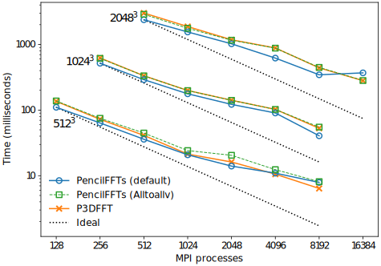

# Benchmarks on the Jean-Zay cluster

[Strong
scaling](https://en.wikipedia.org/wiki/Scalability#Weak_versus_strong_scaling)
benchmarks of 3D real-to-complex FFTs using a 2D ("pencil") decomposition.

The number of MPI processes along each dimension (`P1` and `P2`) is
automatically determined by `MPI_Dims_create`.
In our tests, MPI tends to create a balanced decomposition with `P1 ≈ P2`.
For instance, a total of 1024 processes is divided into `P1 = P2 = 32`.

## Machine

Tests run on the [Jean-Zay cluster](http://www.idris.fr/jean-zay/jean-zay-presentation.html)
([English version](http://www.idris.fr/eng/jean-zay/cpu/jean-zay-cpu-hw-eng.html)) of
IDRIS (CNRS, France).

Some relevant specifications (copied from
[here](http://www.idris.fr/eng/jean-zay/cpu/jean-zay-cpu-hw-eng.html)):

- Cumulated peak performance of 13.9 Pflops/s

- Omni-Path interconnection network 100 Gb/s (1 link per scalar node and
  4 links per converged node)

- Spectrum Scale parallel file system (ex-GPFS)

- 1528 XA730i compute nodes, with 2 Intel Cascade Lake 6248 processors (20
  cores at 2.5 GHz), or 61120 cores available

## Software

The benchmarks were performed using Julia 1.7-beta3 and Intel MPI 2019.
We used PencilFFTs v0.12.5 with FFTW.jl v1.4.3 and MPI.jl v0.19.0.
P3DFFT v2.7.6 (Fortran version) was built with Intel 2019 compilers and linked
to FFTW 3.3.8.

## Version

Date: 30/08/2021, PencilFFTs v0.12.5
